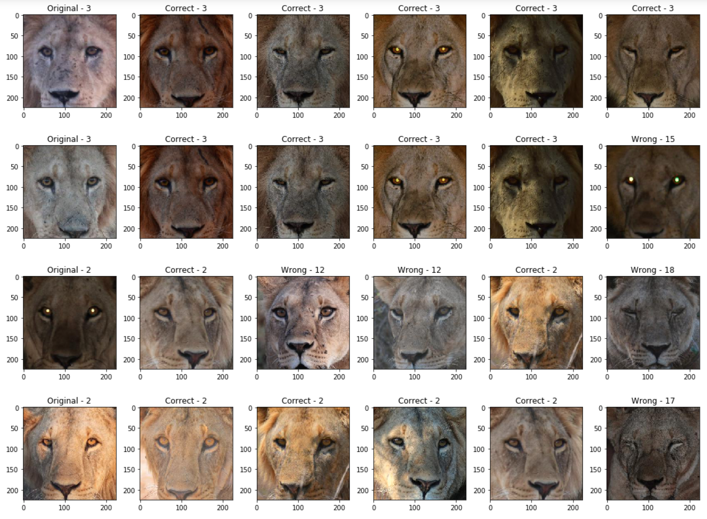

# LINC identification project

This project intends to help LINC in the process of identifying lions by processing their pictures through software. In particular, this project contains a working face identifier and a prototype of a whisker identifier.

The face id project was built using [fastai](fast.ai) and uses [LINC object detector](https://github.com/tryolabs/LINC) to preprocess images.

The whisker id baseline uses *Approximate Wasserstein (Sinkhorn) Distance Between Point-Clouds* from [Point Cloud Utils](https://github.com/fwilliams/point-cloud-utils) and *Coherent Point Drift + Hausdorff distance* from [pycpd](https://github.com/siavashk/pycpd).

 Here is a face id example, `Original` shows the query image and then from left to right predictions are shown (ordered by confidence):



## Installation

Python 3.6 or newer is needed.

First, clone this repository and run:

```bash

pip install -e .

```

## Usage

### Datasets

There are two scripts for creating datasets under the `datasets` folder: `dataset_generator.py` and `train_val_split.py`.  All images are expected to have `.jpg` extension.

For training and adding new lions, the dataset folder structure should be the following:

```
input/
	1/
		image_1.jpg
		image_2.jpg
		...
	2/
		image_32.jpg
		...
	...
```

The folder name __must__ be the lion ID (integer), and images should contain `image_ID` on the filename (as shown above). 

For prediction, the images can be inside a single folder, but the image ID still has to be specified on the filename.

#### Dataset generator

This script creates a copy of a local dataset, algins, and filters the images.

Run `python dataset_generator.py --help` for usage info or look at code docstrings.

#### Dataset splitter

This script splits the dataset into train and validation. Also, filter lions that are beyond the minimum amount of images threshold. The operation is __inplace__.

Run `python train_val_split.py --help` for usage info or look at code docstrings.

### Gallery

The gallery is where the data for identification gets stored after processing all images. In the case of Face Identification, three files are created: `embeddings.pt`, `labels.pt` and `face_image_ids.pt`. On the Whisker Identification code, the files are: `right_data.pt`, `left_data.pt`, `whisker_image_ids.pt`. All of these files must be present for the scripts to work (minus the training script).

### Face identification

#### Training

The datasets folder structure used for training must be the one specified on the __Datasets__ section, and it needs to be splitted into `train` and `valid` with the splitter script.  

The training script not only builds the identification model but also, if `gallery_output_path` is specified, creates the initial gallery needed. 

To force the model to run on CPU, set `CUDA_VISIBLE_DEVICES` to an empty string.
Run `python train.py --help` for usage info. or look at code docstrings

#### Predict

The inference script needs the model pickle and the gallery, these are created by the training script or can be found on the [releases](https://github.com/tryolabs/LINC-identification/releases) page of the repo.

To train the released model, the defaults from the dataset generator and split were used (zoomed images, filter side faces, and a minimum of three images per lion).

The method returns a dictionary with image ids as keys and as value the top N prediction for that image. The top N predictions are represented with a dictionary with lion ids as keys and confidence as value.

To force the model to run on CPU, set `CUDA_VISIBLE_DEVICES` to an empty string.
Run `python predict.py --help` for usage info. or look at code docstrings

#### Adding new lions

Given a folder with the structure specified before, `add_new_lions.py` creates a new gallery that includes all the lions on the input folder. Also, if some lions were already in the current gallery, all the incoming image ids are added to their list.

To force the model to run on CPU, set `CUDA_VISIBLE_DEVICES` to an empty string.
Run `python add_new_lions.py --help` for usage info. or look at code docstrings

### Whisker Identification
#### Create gallery

The `create_gallery` script, handles both the initial gallery creation and the addition of new lions to the current gallery.

The folder structure must be the following:
```
input/
	1/
		left/
			image_1.jpg
			...
		right/
			image_2.jpg
			...
	2/
		left/
			image_32.jpg
			...
		right/
			...
	...
```

The folders within each lion must contain `left` or `right` on their name to be considered by the algorithm.

To update the current gallery the argument `current_gallery_path` must be provided.

Run `python create_gallery.py --help` for usage info or look at code docstrings.

#### Predict
The `predict` script takes either left or right (not both) whisker images and matches them with the corresponding database.

Run `python predict.py --help` for usage info or look at code docstrings.

### Capabilities

Given the gallery path and algorithm, it returns a dictionary that contains lion ids as keys and image ids as values.

Run `python capabilities.py --help` for usage info or look at code docstrings.

### Notebooks

There are a few jupyter notebooks in the `notebooks/` directory, which show some of the original research notebooks, which have a few data visualizations that might be of interest.